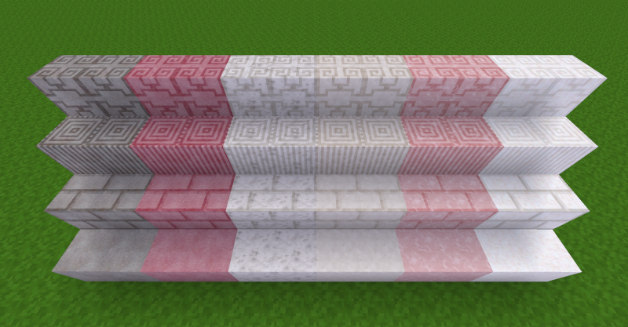

# Quartzy

**DESCRIPTION:**
»Quartzy« (quartzy) adds some quartz blocks to Minetest/Luanti. It uses four different patterns called »plain«, »pillar«, »chiseled« and »brick«. Each pattern comes in six different color variations, ranging from »white«, »light_gray«, »gray«, »dark_gray«, »pink« to »dark pink«. This gives you 24 new quartz blocks to build with.  

Not enough? If you install the mod »Circular Saw«, the possibilities are almost endless.  

**INSTALL:**
Unzip the downloaded folder and rename it to »quartzy« (if necessary). Copy the folder into your »luanti/mods« folder. 

**USE:**
Search the inventory for »quartzy« and have fun building with quartz.  

**DEPENDS:**
This mod requires »default« (»[minetest_game](https://content.luanti.org/packages/Minetest/minetest_game/)«) to work correctly. Optional dependency mod »stairsplus« (included in the mod »[moreblocks](https://content.minetest.net/packages/Calinou/moreblocks/)«)  

**LICENSE:**  
Author: This mod was made by [Norbert Thien, multimediamobil – Region Süd (mmmsued)](https://minetest-modding.weebly.com/), 2025   
Code: Except otherwise specified, all code in this project is licensed as LGPLv3.  
Media: Except otherwise specified, all media and any other content in this project which is not source code is licensed as CC BY SA 3.0.